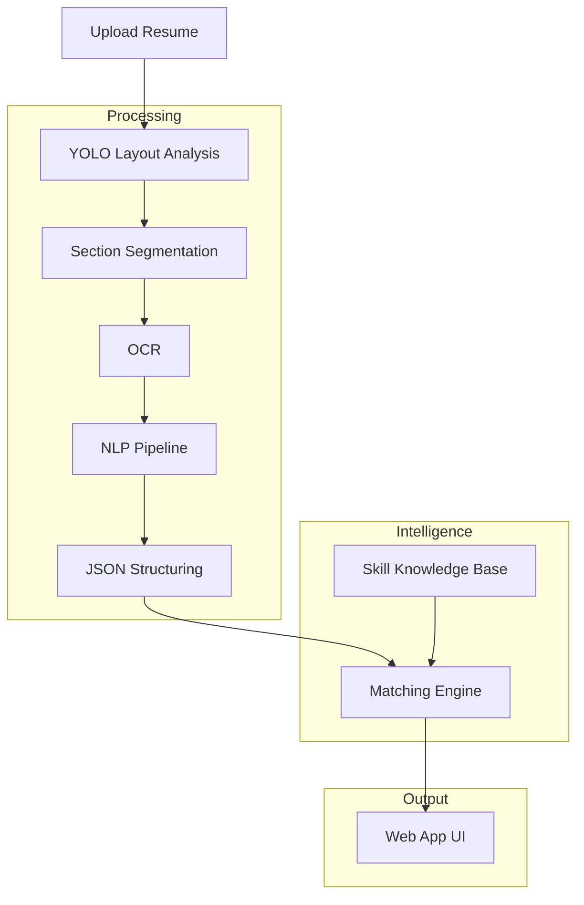
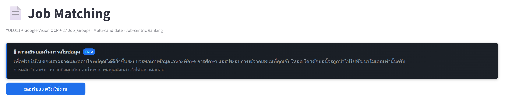
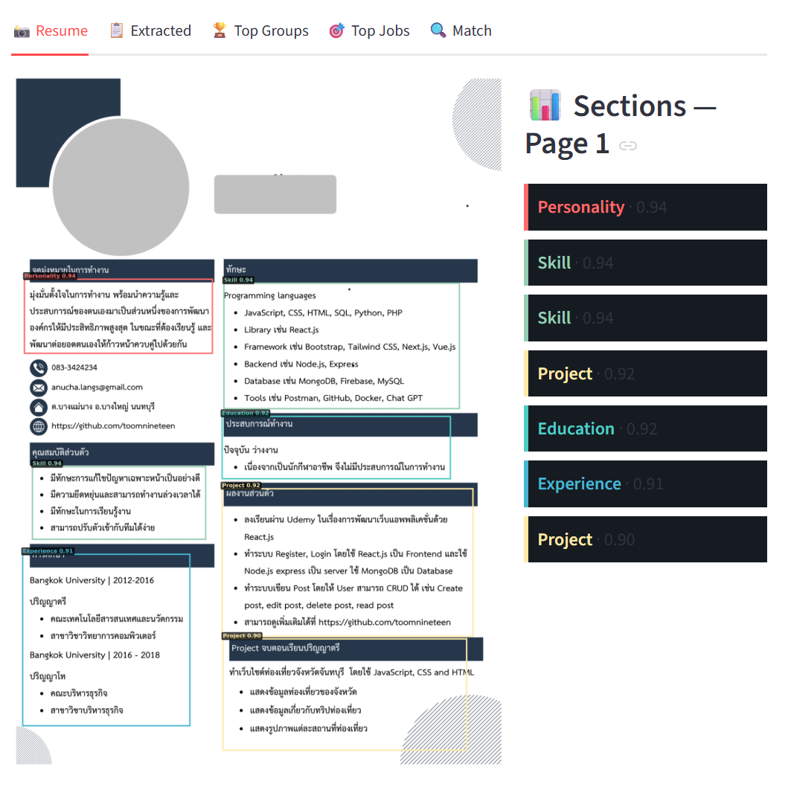
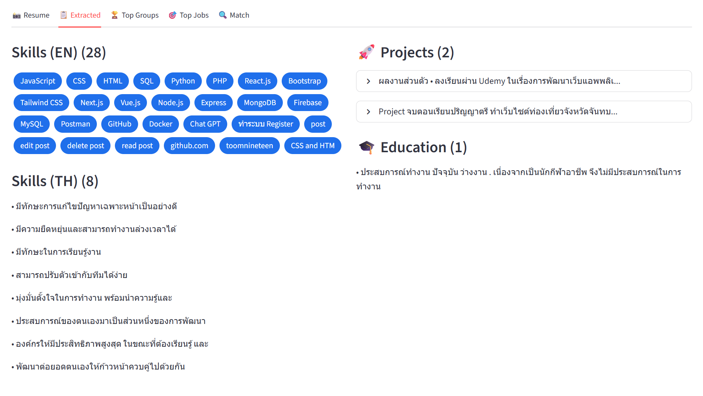
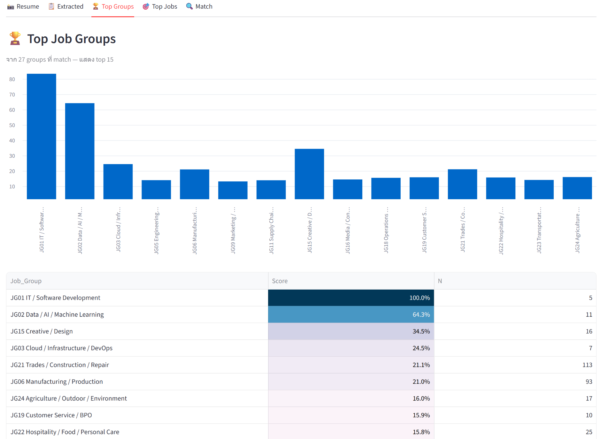
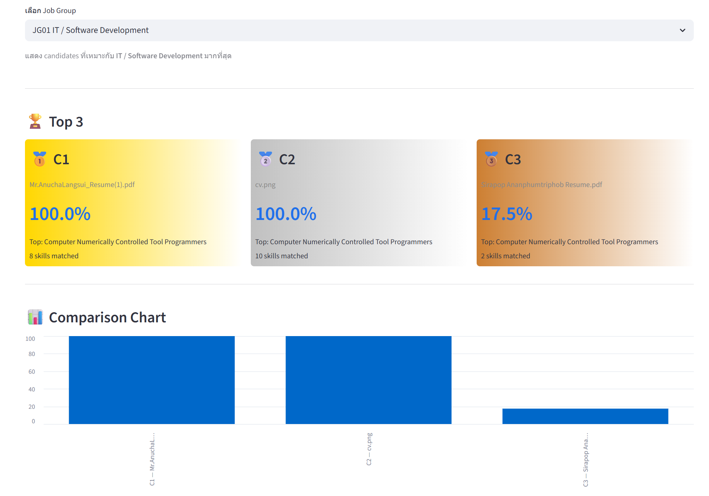

<h1 align="center">📄 Resume Extraction and Processing System for Job Matching</h1>

<p align="center">
  <em>
    This research develops an end-to-end, layout-aware resume parsing pipeline using YOLO, Google Cloud Vision OCR, and bilingual NLP to transform unstructured resumes into structured JSON for automated job matching.
  </em>
</p>

<p align="center">
  ▶️ <a href="https://youtu.be/K7rlNG3W0ng"><strong>Watch Video Presentation</strong></a>
</p>

<p align="center">
  <code>#JobMatching</code>
  <code>#InformationExtraction</code>
  <code>#ComputerVision</code>
  <code>#YOLOv8</code>
  <code>#OCR</code>
  <code>#NLP</code>
</p>

---

## 💡 1 บทนำ (Introduction)

### 🌐 1.1 ความเป็นมาและความสำคัญของปัญหา

ในปัจจุบัน ฝ่ายทรัพยากรบุคคลขององค์กรต่าง ๆ ต้องเผชิญกับความท้าทายในการคัดเลือกบุคลากร เนื่องจากมีเอกสารประวัติการทำงานหรือ "เรซูเม่" (Resume) ส่งเข้ามาเป็นจำนวนมาก ซึ่งส่วนใหญ่อยู่ในรูปแบบไฟล์ภาพหรือ PDF ที่ไม่มีโครงสร้าง (Unstructured Data) แม้ว่าจะมีการนำระบบคัดกรองอัตโนมัติมาใช้ แต่ระบบแบบดั้งเดิมที่อ่านข้อความเพียงอย่างเดียว (Text-only) มักล้มเหลวเมื่อเจอเรซูเม่ยุคใหม่ที่มีการจัดวางหลากหลายคอลัมน์ (Multi-column Layouts) เพราะระบบจะอ่านข้อความเรียงจากซ้ายไปขวาโดยไม่เข้าใจบริบทเชิงพื้นที่ (Spatial Context) ส่งผลให้ข้อความจากคนละคอลัมน์ปนกันจนสกัดข้อมูลผิดพลาด นอกจากนี้ เรซูเม่ในประเทศไทยส่วนใหญ่ยังเป็นแบบสองภาษา (Bilingual) ที่มีทั้งภาษาไทยและอังกฤษผสมกัน ทำให้เกิดปัญหาตัวอักษรผิดพลาด เช่น สระซ้อน วรรณยุกต์ลอย หรือคำศัพท์ภาษาอังกฤษที่เปลี่ยนรูปตามกาล (Inflections) ซึ่งอุปสรรคเหล่านี้ล้วนส่งผลกระทบโดยตรงต่อความแม่นยำในการนำข้อมูลไปประเมินเพื่อจับคู่งาน

จากปัญหาดังกล่าว งานวิจัยนี้จึงได้พัฒนา ระบบสกัดและประมวลผลข้อมูลเรซูเม่เพื่อการจับคู่งาน (Resume Extraction and Processing System for Job Matching) ที่มีความสามารถในการรับรู้โครงสร้างเอกสาร (Layout-Aware) โดยบูรณาการเทคโนโลยีคอมพิวเตอร์วิทัศน์ด้วยแบบจำลอง YOLO ในการตรวจจับและแยกพื้นที่องค์ประกอบหลัก จากนั้นใช้ระบบสกัดข้อความอัตโนมัติ (OCR) สกัดข้อความดิบ ก่อนจะส่งต่อให้ระบบประมวลผลภาษาธรรมชาติ (NLP) ทำการแยกภาษาอัตโนมัติ จนได้ข้อมูลเชิงโครงสร้าง (Structured JSON) ที่มีความแม่นยำสูง ซึ่งแนวทางนี้จะช่วยทำลายข้อจำกัดของระบบแบบเดิม ทำให้ได้ข้อมูลที่สะอาด พร้อมสำหรับการนำไปคำนวณคะแนนจับคู่งาน (Job Matching) ได้อย่างอัตโนมัติและมีประสิทธิภาพสูงสุด

##

### 🎯 1.2 วัตถุประสงค์ของการวิจัย

1. เพื่อพัฒนาแบบจำลองคอมพิวเตอร์วิทัศน์ด้วย YOLO ในการวิเคราะห์โครงสร้างจัดวางเอกสาร (Document Layout Analysis) และจำแนกพื้นที่องค์ประกอบหลักของเรซูเม่ที่มีความหลากหลายคอลัมน์ได้อย่างถูกต้อง
2. เพื่อบูรณาการระบบสกัดข้อความอัตโนมัติ (OCR) และเทคนิคการประมวลผลภาษาธรรมชาติ (NLP) ในการทำความสะอาด จัดการระบบสองภาษา (Bilingual) และแปลงข้อมูลเรซูเม่ให้อยู่ในรูปแบบเชิงโครงสร้าง (Structured JSON)
3. เพื่อพัฒนาและประเมินประสิทธิภาพกลไกการจับคู่งานอัตโนมัติ (Automated Job Matching) ระหว่างคุณสมบัติของผู้สมัครในเรซูเม่เชิงโครงสร้างกับข้อกำหนดของตำแหน่งงาน (Job Description)
4. เพื่อออกแบบและพัฒนาเว็บแอปพลิเคชันต้นแบบ (Web Application Prototype) สำหรับการจับคู่งานอัตโนมัติ ที่สามารถประมวลผลการวิเคราะห์โครงสร้างเอกสารและการจับคู่งาน เพื่อรองรับการใช้งานจริงในกระบวนการสรรหาบุคลากร

##

### 📚 1.3 ขอบเขตของการวิจัย

- **ด้านประชากรและชุดข้อมูล (Data Scope)**
  - ใช้ชุดข้อมูลเอกสารประวัติการทำงาน (Resume) ในรูปแบบไฟล์ภาพและไฟล์เอกสารประเภท PDF รวมทั้งสิ้นจำนวน 200 ฉบับ โดยครอบคลุมลักษณะการจัดวางโครงสร้างเอกสารที่หลากหลาย (เช่น รูปแบบ 1 คอลัมน์ และรูปแบบหลายคอลัมน์)
    และมีเนื้อหาในรูปแบบเอกสารสองภาษา (Bilingual) ทั้งภาษาไทยและภาษาอังกฤษ
  - ใช้ชุดข้อมูลคลังทักษะที่สร้างขึ้นจากการบูรณาการฐานข้อมูลมาตรฐานสากล O*NET Skills ร่วมกับฐานข้อมูลทักษะร่วมสมัยในอุตสาหกรรม Skill2Vec รวมจำนวนรายการคำศัพท์ทักษะมากกว่า 50,000 รายการ เพื่อใช้เป็นฐานข้อมูลอ้างอิงหลัก (Vocabulary Reference Base)
    ในการตรวจจับ สกัดคีย์เวิร์ด และคำนวณคะแนนสำหรับการจับคู่งาน
- **ด้านเทคโนโลยีคอมพิวเตอร์วิทัศน์ (Computer Vision Scope)**
  - ใช้แบบจำลองโครงข่ายประสาทเทียม YOLO11 Series ในการวิเคราะห์โครงสร้างเชิงพื้นที่ของเอกสาร (Document Layout Analysis) เพื่อจำแนกประเภทองค์ประกอบหลักและคำนวณพิกัดขอบเขต (Bounding Box) บนเรซูเม่
  - ใช้กระบวนการสกัดข้อความอัตโนมัติ (Optical Character Recognition: OCR) จากพื้นที่เอกสารที่ผ่านการประมวลผลปรับปรุงสเกลภาพภาพถ่าย (Image Preprocessing)
- **ด้านการประมวลผลภาษาธรรมชาติ (NLP Scope)**
  - ใช้ระบบตรวจสอบรหัสอักขระ (Unicode-based Language Detection) ในการคัดแยกภาษาของข้อความดิบที่สกัดได้จากระบบ OCR โดยอัตโนมัติ เพื่อส่งเข้าสู่กระบวนการเตรียมข้อความ (Text Preprocessing) ที่เหมาะสมกับแต่ละภาษา
  - ใช้ไลบรารี PyThaiNLP ในการปรับบรรทัดฐานข้อความภาษาไทย (Text Normalization) เพื่อแก้ไขปัญหาสระซ้อนและวรรณยุกต์ลอย
  - ใช้ไลบรารี spaCy ในการลดรูปคำศัพท์ภาษาอังกฤษให้กลับสู่รากศัพท์พื้นฐาน (Lemmatization) เพื่อขจัดปัญหาความแตกต่างทางไวยากรณ์ (Inflections) ก่อนนำไปวิเคราะห์ความหมาย
- **ด้านผลลัพธ์ของระบบและการประยุกต์ใช้งาน (Output and Deployment Scope)**
  - ระบบสามารถรวบรวมข้อมูลเชิงพื้นที่และข้อความที่ผ่านการทำความสะอาดแล้ว จัดเก็บให้อยู่ในรูปแบบข้อมูลเชิงโครงสร้าง (Structured JSON)
  - ระบบสามารถนำข้อมูลจากโครงสร้าง JSON ไปคำนวณเปรียบเทียบกับข้อกำหนดของตำแหน่งงาน (Job Description) เพื่อประมวลผลคะแนนความสอดคล้องในการจับคู่งาน (Job Matching Score) ได้อย่างอัตโนมัติ
  - ระบบได้รับการติดตั้งและเผยแพร่ในรูปแบบเว็บแอปพลิเคชันต้นแบบ (Web Application Prototype) บนแพลตฟอร์ม Hugging Face Spaces เพื่อเป็นส่วนประสานงานกับผู้ใช้ (User Interface) ในการประมวลผลแบบทันที (Real-time)

##

### ✅ 1.4 ประโยชน์ที่คาดว่าจะได้รับ (Expected Benefits)

1. ได้ระบบต้นแบบในการสกัดข้อมูลจากเรซูเม่สองภาษาที่มีการจัดวางซับซ้อน (Multi-column Layouts) ซึ่งช่วยลดข้อจำกัดของระบบสกัดข้อความแบบดั้งเดิมที่ไม่รับรู้บริบทเชิงพื้นที่
2. ได้คลังข้อมูลทักษะที่ผ่านการบูรณาการข้อมูลทักษะมาตรฐานและทักษะร่วมสมัย ซึ่งสามารถนำไปต่อยอดใช้เป็นฐานข้อมูลกลางในงานวิจัยด้านการวิเคราะห์ตลาดแรงงานอื่น ๆ ได้
3. เพิ่มประสิทธิภาพในกระบวนการสรรหาบุคลากร (Recruitment Process) ขององค์กร โดยช่วยลดเวลาและแรงงานในการคัดกรองคุณสมบัติผู้สมัครเบื้องต้นผ่านกลไกการคำนวณคะแนนจับคู่งานอัตโนมัติ
4. ได้เว็บแอปพลิเคชันต้นแบบที่บุคคลทั่วไปหรือฝ่ายบริหารทรัพยากรมนุษย์สามารถเข้าถึง และใช้งานระบบสกัดข้อมูลพร้อมจับคู่งานได้จริง

---

## 🔍 2 วิธีดำเนินการวิจัย (Research Methodology)
ในงานวิจัยชิ้นนี้ ได้ทำการออกแบบและพัฒนา ระบบสกัดและประมวลผลข้อมูลเรซูเม่เพื่อการจับคู่งาน (Resume Extraction and Processing System for Job Matching) ซึ่งเป็นระบบแบบไปป์ไลน์ครบวงจร (End-to-End Pipeline) ที่ผสานเทคโนโลยีคอมพิวเตอร์วิทัศน์ การประมวลผลภาษาธรรมชาติ และการพัฒนาเว็บแอปพลิเคชันเข้าด้วยกัน โดยแบ่งขั้นตอนการดำเนินงานวิจัยออกเป็นหัวข้อหลักดังต่อไปนี้

### ⚙️ 2.1 สถาปัตยกรรมรวมของระบบ (Overall System Architecture)
กระบวนการทำงานของระบบถูกออกแบบให้เป็นแบบครบวงจร (End-to-End Pipeline) เริ่มต้นจากการที่ผู้ใช้ทำการนำเข้าเอกสารประวัติการทำงาน (Resume) ในรูปแบบไฟล์ภาพหรือเอกสาร PDF ผ่าน Web Application จนถึง Job Matching



##

### 🧮 2.2 การสร้างคลังข้อมูลทักษะ (Skill Reference Dataset Construction)
- **การดึงชุดข้อมูลทักษะมาตรฐาน (O*NET Skills Data Extraction):** นำเข้ารายการคำศัพท์ทักษะมาตรฐานสากลจากฐานข้อมูล O*NET เพื่อเป็นแกนอ้างอิงเชิงวิชาชีพ
- **การดึงชุดข้อมูลทักษะร่วมสมัย (Skill2Vec Data Extraction):** นำเข้าชุดข้อมูลทักษะที่ใช้จริงในประกาศรับสมัครงานร่วมสมัย (Modern Job Postings) จากคลังข้อมูล Skill2Vec จำนวนกว่า 50,000 รายการ
- **การบูรณาการและปรับประสานข้อมูล (Data Integration & Harmonization):** ทำการรวมชุดข้อมูลทั้งสองเข้าด้วยกัน ผ่านกระบวนการตัดคำซ้ำซ้อน (De-duplication) และปรับแต่งบรรทัดฐานตัวอักษรให้อยู่ในโครงสร้างรูปแบบเดียวกัน ได้ผลลัพธ์เป็นไฟล์คลังคำศัพท์กลางเพื่อใช้เป็นฐานสำหรับ
  การจับคู่ความหมาย

##

### 🖼️ 2.3 การวิเคราะห์และแยกแยะโครงสร้างเอกสารเชิงพื้นที่ (Document Layout Analysis using YOLO)
- **การทดลองเปรียบเทียบแบบจำลองในตระกูล YOLO11 (YOLO11 Series Experimentation):** ทำการฝึกฝน (Training) และทดลองเปรียบเทียบประสิทธิภาพของแบบจำลองโครงข่ายประสาทเทียมระดับคอนโวลูชันในขนาดที่แตกต่างกัน ได้แก่ YOLO11n, YOLO11s, YOLO11m และ YOLO11xl ภายใต้สภาพแวดล้อมและพารามิเตอร์การควบคุมเดียวกัน เพื่อจำแนกประเภทส่วนประกอบหลัก 6 ประเภท ได้แก่ Personality, Education, Experience, Skills, Project และ Training โดยใช้เกณฑ์ตัวชี้วัดมาตรฐานทางคอมพิวเตอร์วิทัศน์ คือ ค่า Precision, Recall และ mAP@0.5 เป็นดัชนีในการคัดเลือกแบบจำลองที่ดีที่สุดเพื่อนำไปใช้งานจริง
- **กระบวนการตัดขอบเขตภาพส่วนประกอบแบบประยุกต์สเกล (Section-based Image Cropping with Padding):** เมื่อแบบจำลองที่ชนะการทดลองทำการทำนายและระบุพิกัดพื้นที่ (Bounding Box) ระบบจะเข้าสู่ลอจิกการตัดภาพ โดยมีการคำนวณและเพิ่มค่าสัดส่วนขยายขอบกล่องข้อความ (Bounding Box Padding) เพื่อป้องกันไม่ให้ตัวอักษรหรือสระที่อยู่บริเวณชิดขอบเขตภาพถูกตัดขาด ก่อนจะทำการสกัดภาพออกเป็นส่วนคัตเอาท์ย่อยแยกตาม Label

##

### 📷 2.4 กระบวนการสกัดข้อความอัตโนมัติจากพื้นที่โครงสร้างเอกสาร (Automated Text Extraction via OCR)
- **การทดลองเปรียบเทียบกลไกสกัดข้อความ (OCR Engines Comparison):** ทำการกำหนดสภาพแวดล้อมและทดลองเปรียบเทียบกลไกการแปลงรหัสภาพเป็นข้อความจากหลากหลายค่ายเทคโนโลยี ได้แก่ PaddleOCR, Surya OCR, EasyOCR และ Google Cloud Vision เพื่อพิจารณาและคัดเลือกโมเดลที่มีความแม่นยำสูงสุดในการจดจำอักขระภาษาไทย ความเร็วในการประมวลผลต่อหนึ่งหน้าเอกสาร และความเสถียรในการทำงานบนระบบคลาวด์

##

### 🔢 2.5 การประมวลผลภาษาธรรมชาติระดับต้นและการจัดโครงสร้างข้อมูลเชิงความหมาย (Shallow NLP and Semantic Data Structuring)
- **การจำแนกภาษาด้วยรหัสอักขระอัตโนมัติ (Unicode-based Language Detection):** ระบบจะอ่านข้อความดิบในแต่ละส่วนและทำการตรวจสอบช่วงรหัส Unicode เพื่อแบ่งแยกโดยอัตโนมัติว่าข้อความในโครงสร้างนั้นเป็นข้อความภาษาไทยหรือภาษาอังกฤษ เพื่อส่งต่อไปยังฟังก์ชันทำความสะอาดข้อมูลเฉพาะทาง
- **การปรับบรรทัดฐานภาษาไทย (Thai Text Normalization):** ข้อความภาษาไทยจะถูกส่งเข้ากระบวนการทำความสะอาดข้อความด้วยคำสั่งปรับบรรทัดฐาน (Text Normalization) ผ่านไลบรารี PyThaiNLP เพื่อตัดสัญลักษณ์ขยะ และขจัดปัญหาข้อผิดพลาดเชิงโครงสร้างอักขระ เช่น สระซ้อน หรือวรรณยุกต์ลอยที่เกิดจากข้อจำกัดของกลไก OCR
- **การลดรูปรากศัพท์ภาษาอังกฤษ (English Lemmatization):** ข้อความภาษาอังกฤษจะถูกส่งเข้ากระบวนการประมวลผลผ่านไลบรารี spaCy เพื่อทำกระบวนการ Lemmatization ในการลดรูปคำศัพท์ที่ผันตามหลักไวยากรณ์ (เช่น พหูพจน์ หรือ กริยาช่องต่างๆ) ให้กลับคืนสู่คำศัพท์รากพื้นฐาน ซึ่งช่วยเพิ่มความถูกต้องในการวิเคราะห์คำสำคัญ
- **การแปลงรูปแบบสู่ข้อมูลเชิงโครงสร้าง (Data Structuring to JSON):** เมื่อข้อความทั้งหมดผ่านการลบช่องว่างขยะและทำความสะอาดแล้ว ระบบจะนำคำศัพท์เหล่านั้นผูกคู่เชิงตำแหน่ง (Key-Value Pairing) เข้ากับ Label จากโมเดล YOLO แล้วแปลงโครงสร้างข้อมูลทั้งหมดให้อยู่ในรูปแบบพจนานุกรมเชิงโครงสร้าง (Structured JSON) ที่พร้อมนำไปใช้งานในขั้นถัดไป

##

### 🤝 2.6 กลไกการจับคู่งานและการติดตั้งใช้งานบนเว็บแอปพลิเคชัน (Job Matching and Web Application Deployment)
- **กลไกการคำนวณและประเมินผลการจับคู่งาน (Job Matching Scoring):** ระบบทำการรับข้อมูลข้อกำหนดของตำแหน่งงาน (Job Description) ที่ผู้ใช้งานป้อนเข้ามา จากนั้นจะนำโครงสร้างข้อมูลเรซูเม่ที่เป็น JSON มาคำนวณเปรียบเทียบและวิเคราะห์ค่าความคล้ายคลึงเชิงคีย์เวิร์ดและทักษะ (Keyword & Skill Similarity Evaluation) โดยอ้างอิงเทียบกับฐานข้อมูลอ้างอิง เพื่อประมวลผลคิดคำนวณออกมาเป็นดัชนีคะแนนความสอดคล้องในการจับคู่งาน (Job Matching Score)
- **การออกแบบส่วนประสานงานและการติดตั้งใช้งานระบบ (User Interface & Deployment):** เพื่อให้ระบบสามารถนำไปประยุกต์ใช้งานได้จริง งานวิจัยนี้จึงได้นำไปป์ไลน์การสกัดข้อความและการจับคู่งานทั้งหมด ไปออกแบบตัวประสานงานผู้ใช้และทำการติดตั้งระบบใช้งานจริง (Deployment) ในรูปแบบเว็บแอปพลิเคชันต้นแบบ (Web Application Prototype) บนแพลตฟอร์ม Hugging Face Spaces ซึ่งรองรับการอัปโหลดเอกสารเรซูเม่และการประมวลผลคำนวณคะแนนจับคู่งานแบบทันที

---

## 🧠 3 ผลการดำเนินงานและวิเคราะห์ผล

### 💼 3.1 การจัดเตรียมชุดข้อมูลและการติดป้ายกำกับองค์ประกอบ (Data Preparation and Labeling Results)
ในเฟสการตรวจจับโครงสร้างเอกสาร (Layout Detection) คณะผู้จัดทำได้ดำเนินการรวบรวมไฟล์เอกสารเรซูเม่สองภาษาจำนวนทั้งสิ้น 200 ฉบับ เพื่อนำมาเข้าสู่กระบวนการเตรียมข้อมูลสำหรับฝึกฝนโมเดลคอมพิวเตอร์วิทัศน์ โดยมีผลการดำเนินงานดังนี้

### 📚 3.1.1 Input
ข้อมูลนำเข้า (Input) เป็นเรซูเม่ในรูปแบบไฟล์ภาพหรือ PDF ซึ่งทั้งหมดจะผ่านการแปลงเป็นภาพก่อนนำเข้าสู่กระบวนการประมวลผล โดยเรซูเม่แต่ละใบมีรูปแบบการจัดวางที่แตกต่างกัน เช่น แบบหนึ่งคอลัมน์และสองคอลัมน์


### 🔢 3.1.2 Label
ป้ายกำกับ (Label) ถูกสร้างขึ้นเพื่อระบุขอบเขตของแต่ละ section ภายในเรซูเม่ โดย Label มีทั้งหมด 6 Class ได้แก่ Personality, Education, Experience, Skill, Project, Training โดยใช้รูปแบบ bounding box เพื่อกำหนดตำแหน่งเชิงพื้นที่ของข้อมูลในหน้าเอกสาร 


### 🧮 3.1.3 Output (ผลลัพธ์จากขั้นตอนการ Labeling)
ผลลัพธ์ของขั้นตอนนี้คือชุดข้อมูลที่ผ่านการจับคู่ระหว่างรูปเรซูเม่และป้ายกำกับอย่างสมบูรณ์ (image–label pairs) ซึ่งจะนำไปใช้เป็นข้อมูลฝึกและทดสอบโมเดล Layout Detection ในขั้นตอนถัดไป 


---

### 🧿 3.2 การวิเคราะห์และแยกแยะโครงสร้างเอกสารเชิงพื้นที่ (Document Layout Analysis using YOLO)
เมื่อเสร็จสิ้นกระบวนการป้ายกำกับชุดข้อมูล คณะผู้จัดทำได้นำภาพเรซูเม่เข้าสู่เฟสการทดลองฝึกฝนและทดสอบประสิทธิภาพ เพื่อคัดเลือกสถาปัตยกรรมที่ดีที่สุดมาเป็นแกนหลักในการตรวจจับโครงสร้างเอกสาร โดยแบ่งผลการวิเคราะห์ออกตามลำดับขั้นตอนดังนี้:

### 🤖 3.2.1 ผลการทดลองและการวัดประสิทธิภาพของโมเดล Layout Detection (YOLO)


จากผล Confusion Matrix พบว่าภาพรวมของโมเดลสามารถแยกแยะคลาสที่มีอัตลักษณ์เฉพาะตัวสูงได้ค่อนข้างแม่นยำ ทว่าเมื่อพิจารณาเปรียบเทียบในแง่ของความสมดุล (Optimization) ระหว่างค่าความถูกต้องเชิงมิติและความเร็วในการประมวลผล (Inference Speed) คณะผู้จัดทำได้ตัดสินใจคัดเลือกโมเดลขนาด YOLO11s (Small) มาใช้งานเป็นตัวแบบหลัก เนื่องจากผลลัพธ์จาก Confusion Matrix ชี้ให้เห็นว่าให้อัตราความผิดพลาดต่ำใกล้เคียงกับโมเดลขนาดใหญ่ (Medium/X-Large) แต่ใช้ทรัพยากรระบบและเวลาประมวลผลต่อภาพต่ำกว่ามาก ซึ่งจำเป็นต่อการนำไปใช้งานจริงบนเว็บแอปพลิเคชัน

##

### 📈 3.2.2 ผลการเรียนรู้และเสถียรภาพของโมเดลที่คัดเลือก (YOLO11s Training & Validation Curves)


หลังจากระบุเลือกตัวแบบ YOLO11s แล้ว คณะผู้จัดทำได้ทำการวิเคราะห์พฤติกรรมการเรียนรู้เชิงลึกตลอดการฝึกฝน โดยพิจารณาจากเส้นกราฟ Train/Val Loss Curves ร่วมกับ F1-Confidence Curve และ Precision-Recall Curve เฉพาะของโมเดล YOLO11s พบว่า ค่าความสูญเสีย (Loss) ทั้งในชุดฝึกฝนและชุดทดสอบความถูกต้องมีแนวโน้มลดลงอย่างต่อเนื่องและลู่เข้าหากันอย่างมีเสถียรภาพ ไม่ปรากฏสัญญาณของ Overfitting ขณะที่พื้นที่ใต้กราฟความแม่นยำเฉลี่ย (mAP) พุ่งสูงขึ้นและคงที่ในระดับสูง พิสูจน์ได้ว่าโมเดล YOLO11s ที่คัดเลือกมีความพร้อมสูงในการทำงานร่วมกับข้อมูลที่ไม่เคยพบมาก่อน

##

### ⭐ 3.2.3 ผลการวิเคราะห์โครงสร้างเชิงพื้นที่จริง (YOLO11s Inference Results):


จากการนำโมเดล YOLO11s ไปรันทำนายผลจริงกับเอกสารเรซูเม่ชุดทดสอบ (Test Set) พบว่าระบบสามารถตีกรอบพิกัด (Bounding Box) พร้อมระบุป้ายกำกับคลาสส่วนประกอบหลักทั้ง 6 คลาส ได้อย่างครบถ้วนและแม่นยำสูง แม้จะเป็นเอกสารที่มีการจัดวาง Layout ซับซ้อนแบบหลายคอลัมน์ ระบบก็สามารถแยกแยะขอบเขตเชิงพื้นที่ออกจากกันได้ โดยไม่มีปัญหาข้อความข้ามช่องปนเปกัน ผลลัพธ์พิกัด Bounding Box จากโมเดล YOLO11s นี้ จะส่งต่อไปสู่กระบวนการสกัดข้อความ (OCR) ในขั้นตอนถัดไป

##

### 📊 3.2.4 ผลการประเมินประสิทธิภาพรายคลาส (Per-Class Results)
เพื่อวัดความสามารถในการระบุขอบเขตพิกัดและการจำแนกประเภทส่วนประกอบ ทั้ง 6 คลาส บนชุดข้อมูลทดสอบ (Test Set) โดยใช้ตัวชี้วัดมาตรฐานสากลในงานตรวจจับวัตถุ (Object Detection) ได้แก่ Precision Recall และ ค่า mAP@0.5 ซึ่งได้ผลดังตาราง

| Class        | Precision | Recall | mAP50 |
|--------------|-----------|--------|-------|
| Personality  | 100.0%    | 62.9%  | 80.9% |
| Education    | 72.0%     | 56.5%  | 65.5% |
| Experience   | 94.7%     | 56.0%  | 72.3% |
| Skill        | 70.8%     | 40.5%  | 60.4% |
| Project      | 75.5%     | 100.0% | 97.3% |
| Training     | 97.6%     | 78.6%  | 81.7% |
| **Overall**  | –         | –      | **76.3%** |

จากตารางผลการประเมิน ชี้ให้เห็นว่าโมเดล YOLO11s สามารถตรวจจับและจำแนก Layout ของเอกสารที่มีความหลากหลายเชิงโครงสร้างได้อย่างมีประสิทธิภาพสูง โดยมีค่า mAP@0.5 ในภาพรวมเฉลี่ยเท่ากับ 76.3% ซึ่งจัดอยู่ในเกณฑ์ที่เหมาะสมและน่าเชื่อถือสำหรับงานวิเคราะห์โครงสร้างจัดวางเอกสาร (Document Layout Analysis)

##

### 🏗️ 3.2.5 ผลจากการปรับแต่งโมเดลเชิงลึกเพื่อเพิ่มความแม่นยำในคลาสทักษะ (Fine-tuning Results for Skill Enhancement)
เนื่องจากเป้าหมายสูงสุดของโครงงานนี้คือการพัฒนาระบบจับคู่งานที่มีประสิทธิภาพ คลาส Skill จึงเป็นคลาสที่มีความสำคัญที่สุด โดยผลของการประเมินประสิทธิภาพของโมเดลแรก ชี้ให้เห็นว่าคลาส Skill มีค่า Recall ต่ำที่สุด เพียง 40.5% และมีค่า mAP@0.5 อยู่ที่ 60.4% 

ด้วยเหตุนี้จึงได้ทำการ Fine-tuning โดยการจัดเตรียมและเพิ่มชุดข้อมูลเพิ่มเติมจากแพลตฟอร์ม Roboflow เพื่อปรับปรุงให้แบบจำลองเกิดความเชี่ยวชาญในการจำแนกคลาส Skill โดยหลังจากการทำ Fine-tuning พบว่า **ค่า Recall เพิ่มขึ้นเป็น 61.7%** และ**ค่า mAP@0.5 เพิ่มขึ้นเป็น 61.7%** ซึ่งเป็นการพิสูจน์ว่าชุดข้อมูลเพิ่มเติมที่เพิ่มเข้าไปช่วยทำให้แบบจำลองสามารถรับรู้ลักษณะเด่น (Feature Extraction) ของข้อมูล Class Skill ได้อย่างแม่นยำยิ่งขึ้น

---

## 🔤 3.3 กระบวนการสกัดข้อความอัตโนมัติจากพื้นที่โครงสร้างเอกสาร (Automated Text Extraction via OCR)

### 📈 3.3.1 ผลการทดลองเปรียบเทียบประสิทธิภาพกลไกสกัดข้อความ (OCR Engines Performance)
เพื่อคัดเลือกกลไกการสกัดข้อความที่มีความถูกต้องสูงสุด คณะผู้จัดทำได้ทำการทดลองเปรียบเทียบประสิทธิภาพของกลไกประมวลผลอักขระอัตโนมัติ (OCR Engines) จำนวน 4 ตัวเลือก ได้แก่ PaddleOCR, SuryaOCR, EasyOCR และ Google Cloud Vision API โดยนำชุดภาพโครงสร้างเรซูเม่ที่สกัดได้ไปทดสอบประมวลผลภายใต้สภาพแวดล้อมการควบคุมเดียวกัน

| OCR Engine                 | ความถูกต้องภาษาไทย | ความถูกต้องภาษาอังกฤษ | ข้อผิดพลาดเชิงโครงสร้าง (สระซ้อน/วรรณยุกต์ลอย) | ความเสถียรของระบบคลาวด์/ความเร็ว |
|--------------------------|------------------|---------------------|----------------------------------------------|--------------------------------|
| PaddleOCR                | พอใช้            | ดี                  | พบข้อผิดพลาดปานกลางในกลุ่มสระลอย            | ปานกลาง                       |
| Surya OCR                | พอใช้            | ดีมาก               | พบปัญหาการเว้นวรรคและช่องไฟภาษาไทย           | ค่อนข้างช้า                   |
| EasyOCR                  | ควรปรับปรุง       | ดี                  | พบปัญหาตัวอักษรไทยขาดหายและสระลอยสูง        | เร็ว (รันภายในเครื่อง)        |
| Google Cloud Vision API  | ดีมาก            | ดีมาก               | พบน้อยที่สุด (มีความถูกต้องเชิงโครงสร้างสูง)   | เร็วมาก (ตอบสนองผ่านคลาวด์)   |

จากตารางพบว่า Google Cloud Vision API เป็นกลไกที่ให้ประสิทธิภาพสูงสุดในทุกมิติ โดยเฉพาะอย่างยิ่งในการรับรู้และสกัดอักขระภาษาไทย ซึ่งเป็นข้อจำกัดของโมเดลรูปแบบออฟไลน์ (เช่น EasyOCR หรือ PaddleOCR) ที่มักจะตัดคำผิดพลาด แต่ทว่า Google Cloud Vision API จำเป็นต้องมี API Key ในการใช้งาน แต่สามารถใช้งานได้ฟรี 1,000 รูป/เดือน

##

### 🔀 3.3.2 กระบวนการทำงานของระบบสกัดข้อความอัตโนมัติ (OCR)

### Function 1: preprocess_crop() ฟังก์ชันการปรับปรุงสเกลภาพถ่ายเชิงไดนามิก
ก่อนที่ภาพถ่ายส่วนคัตเอาท์จะถูกส่งต่อไปยังระบบตรวจจับอักขระ ภาพเหล่านั้นจะถูกส่งเข้าสู่ฟังก์ชันการเตรียมข้อมูลภาพเบื้องต้น (Image Preprocessing) เพื่อตรวจสอบขนาดเชิงพิกเซล หากระบบตรวจสอบพบว่าความสูงของภาพคัตเอาท์มีขนาดเล็กกว่าเกณฑ์มาตรฐานที่กำหนดไว้อยู่ในตัวแปรคอนฟิก (h < CONFIG['min_crop_height']) ระบบจะใช้ฟังก์ชันคำสั่งปรับขนาดเชิงภาพด้วยเทคนิคการประมาณค่าพิกเซลแบบลูกบาศก์ (Cubic Interpolation) ผ่านคำสั่ง cv2.resize ร่วมกับพารามิเตอร์ cv2.INTER_CUBIC เพื่อทำการขยายสัดส่วนภาพถ่าย (Upscaling) ให้มีความละเอียดและความคมชัดของขอบตัวอักษรที่สูงขึ้น ซึ่งช่วยลดอัตราการอ่านอักษรขนาดเล็กผิดพลาดได้อย่างมีนัยสำคัญ

```python
def preprocess_crop(crop_img):
    h, w = crop_img.shape[:2]
    if h < 50:
        scale = 50 / h
        crop_img = cv2.resize(...)
    return crop_img
```

##

### Function 2: extract_text_from_crop() 
- กระบวนการแปลงรหัสโครงสร้างภาพเพื่อส่งผ่านระบบคลาวด์ เนื่องจากตัวแปลงรหัสอักขระภายนอกอย่าง Google Cloud Vision API ทำการประมวลผลผ่านสถาปัตยกรรมระบบคลาวด์ ระบบจึงจำเป็นต้องเปลี่ยนสถานะข้อมูลภาพจากอาร์เรย์พิกเซลปกติ (BGR Image Array) ให้อยู่ในรูปแบบรหัสข้อความที่สามารถจัดส่งผ่านโปรโตคอลเครือข่ายอินเทอร์เน็ตได้ โดยไปป์ไลน์จะเรียกใช้ฟังก์ชันการเข้ารหัสฐาน 64 หรือ base64.b64encode() ในการแปลงไฟล์ภาพคัตเอาท์ให้อยู่ในรูปของกลุ่มรหัสข้อความ (Base64 String) เพื่อนำไปบรรจุลงในส่วนโครงสร้างข้อมูลนำเข้า (Request Payload) ของระบบต่อไป

- ฟังก์ชันการเรียกใช้บริการตรวจจับข้อความสองภาษาแบบระบุคำสั่งอ้างอิง หลังจากระบุโครงสร้างรูปภาพพร้อมใช้แล้ว ระบบจะทำการเรียกฟังก์ชัน client.text_detection() โดยมีการกำหนดค่าพารามิเตอร์เพื่อควบคุมความแม่นยำ 2 ส่วน คือ
  - กำหนดคุณลักษณะการตรวจจับเป็นแบบประเภทตรวจจับตัวอักษรทั่วไป (TEXT_DETECTION)
  - กำหนดพารามิเตอร์สำหรับการอ้างอิงแบบสองภาษาในโครงสร้างอินพุต หรือ language_hints=['th', 'en'] เพื่อกำหนดกรอบให้ระบบ AI คลาวด์รับรู้และจำแนกอักขระภาษาไทยและภาษาอังกฤษที่วางผสมปนเปกันอยู่บนเอกสารเรซูเม่ได้อย่างแม่นยำสูงสุด

- กลไกการสกัดและดึงผลลัพธ์ข้อความดิบกลับสู่ระบบ (Response Parsing) เมื่อระบบคลาวด์ของ Google ทำการประมวลผลเสร็จสิ้นและส่งข้อมูลกลับมา (JSON API Response) ไปป์ไลน์จะแกะเอาเฉพาะข้อมูลข้อความรวมทั้งหมดผ่านมางการอ้างอิงอาร์เรย์ชุดแรก เช่น response.text_annotations[0].description ซึ่งลอจิกในส่วนนี้จะทำหน้าที่สกัดเอาเฉพาะเนื้อหาข้อความดิบรวม (raw_text) ออกมาเป็นตัวแปรประเภทสายอักขระ (String) ก้อนเดี่ยว และทำการตัดข้อมูลเชิงมิติพิกเซลอื่น ๆ (Metadata) ที่ไม่จำเป็นทิ้งไป เพื่อส่งข้อความดิบชุดนี้ข้ามฝั่งไปประมวลผลต่อในเฟส Bilingual NLP Pipeline ในหัวข้อถัดไป

```python
def extract_text_from_crop(crop_img):
    """Run Google Cloud Vision OCR on crop."""
    processed = preprocess_crop(crop_img)

    # Encode image to base64
    _, buffer = cv2.imencode('.jpg', processed)
    img_base64 = base64.b64encode(buffer).decode('utf-8')

    # Call Vision API
    payload = {
        'requests': [{
            'image': {'content': img_base64},
            'features': [{'type': 'TEXT_DETECTION'}],
            'imageContext': {'languageHints': ['th', 'en']}
        }]
    }

    response = requests.post(VISION_URL, json=payload)
    result = response.json()

    raw_text = ''
    if 'responses' in result and result['responses']:
        annotations = result['responses'][0].get('textAnnotations', [])
        if annotations:
            raw_text = annotations[0].get('description', '').strip()

    clean_text = postprocess(raw_text)
    return raw_text, clean_text
```

--- 

## 🔡 3.4 กระบวนการประมวลผลภาษาธรรมชาติสองภาษา (Bilingual NLP Pipeline)
หลังจากตัวแปรข้อความดิบ (raw_text) ถูกส่งมอบมาจากฟังก์ชัน OCR ระบบจะขับเคลื่อนเข้าสู่กระบวนการทำความสะอาดและจัดระเบียบโครงสร้างข้อมูลภาษาธรรมชาติผ่านฟังก์ชันหลัก postprocess(raw_text) โดยไปป์ไลน์ในส่วนนี้ถูกออกแบบมาเพื่อแก้ไขปัญหาอักขระขยะ สระลอย วรรณยุกต์ซ้อน และการผันรูปทางไวยากรณ์ตามบริบทของเอกสารสองภาษา (Bilingual Context) โดยมีลำดับขั้นตอนลอจิกการประมวลผลดังต่อไปนี้

### 📚 3.4.1 กลไกการคัดแยกภาษาอัตโนมัติด้วยช่วงรหัสอักขระ (Unicode-based Language Detection)
เนื่องจากข้อความดิบที่สกัดได้จากเรซูเม่มีทั้งภาษาไทยและภาษาอังกฤษปะปนกัน ระบบจึงต้องระบุภาษาเพื่อเลือกไปป์ไลน์ในการทำความสะอาดข้อมูลที่เหมาะสม โดยการใช้เงื่อนไขตรวจสอบรหัสอักขระยูนิโค้ดอ้างอิงภาษาไทยผ่านคำสั่งคำนวณเชิงตรรกะ any('\u0e00' <= c <= '\u0e7f' for c in text) หากตัวแปรตรวจสอบพบอักขระภาษาไทยแม้เพียงบางส่วน ระบบจะจำแนกข้อความกล่องนั้นให้อยู่ในกลุ่มภาษาไทยโดยอัตโนมัติเพื่อส่งเข้าฟังก์ชัน postprocess_thai() แต่หากไม่พบโครงสร้างรหัสยูนิโค้ดดังกล่าว ระบบจะส่งข้อความเข้าสู่วิธีการประมวลผลภาษาอังกฤษในฟังก์ชัน postprocess_en() ตามลำดับ

```python
def postprocess(text):
    """Combined cleaner — Thai normalize + English lemmatize."""
    if not text:
        return text

    has_thai = any('\u0e00' <= c <= '\u0e7f' for c in text)

    if has_thai:
        text = postprocess_thai(text)
    else:
        text = postprocess_en(text)

    text = ' '.join(text.split())
    return text
```

##

### 📊 3.4.2 ขั้นตอนการปรับบรรทัดฐานภาษาไทยด้วยเทคโนโลยี PyThaiNLP
เมื่อข้อมูลถูกคัดแยกเป็นชุดข้อความภาษาไทย ปัญหาที่มักเกิดจากระบบ OCR คือการตรวจจับอักขระขยะ หรือโครงสร้างภาษาไทยที่ผิดเพี้ยน เช่น สระบน-ล่างซ้อนกัน หรือวรรณยุกต์ลอยจนระบบตัดคำวิเคราะห์ความหมายไม่ได้ ฟังก์ชัน postprocess_thai() จะเรียกใช้ฟังก์ชัน th_normalize() จากไลบรารี PyThaiNLP เพื่อทำความสะอาดสระซ้อนและปรับระดับวรรณยุกต์ให้กลับมาถูกต้องตามมาตรฐานไวยากรณ์ พร้อมทั้งตัดช่องว่างส่วนเกินเพื่อให้เป็นสายอักขระที่พร้อมนำไปใช้งาน

```python
def postprocess_thai(text):
    """Thai text post-processing — normalize."""
    if not text:
        return text
    text = th_normalize(text)
    text = ' '.join(text.split())
    return text
```

##

### 🔤 3.4.3 ขั้นตอนการลดรูปรากศัพท์ภาษาอังกฤษด้วยโครงข่าย spaCy
เมื่อข้อมูลถูกคัดแยกเป็นชุดข้อความภาษาอังกฤษ ปัญหาคือคำศัพท์มักถูกผันตามหลักไวยากรณ์ เช่น คำกริยาในรูปกาลเวลาต่าง ๆ (e.g., developing, developed) หรือคำนามพหูพจน์ ซึ่งหากปล่อยไว้จะทำให้ระบบจับคู่คำศัพท์ผิดพลาด ฟังก์ชัน postprocess_en() จึงได้นำเข้าโมเดลภาษาของไลบรารี spaCy เพื่อทำกระบวนการ Lemmatization ผ่านกลไกเรียกใช้งาน token.lemma_ ในการแปลงคำศัพท์ที่ผันรูปทั้งหมดให้กลับคืนสู่ "รากศัพท์พื้นฐาน" (เช่น เปลี่ยนคำว่า working และ works ให้กลับมาอยู่ในรูปรากศัพท์คำว่า work ทั้งหมด)

```python
def postprocess_en(text):
    """English lemmatization via spaCy."""
    if not text or not HAS_SPACY:
        return text
    doc = nlp(text)
    return ' '.join(token.lemma_ for token in doc)
```

##

### 🧹 3.4.4 การกำจัดสิ่งรบกวนเชิงพื้นที่และการส่งออกข้อมูลโครงสร้างสะอาด
ในขั้นตอนสุดท้ายของไปป์ไลน์ภาษาธรรมชาติ ข้อมูลที่ผ่านการปรับบรรทัดฐานและการลดรูปรากศัพท์เรียบร้อยแล้ว จะถูกนำมาสกัดขจัดช่องว่างและสัญลักษณ์ขยะส่วนเกินด้วยฟังก์ชันคำสั่งจัดกลุ่มตัวอักษร ' '.join(text.split()) เพื่อส่งคืนผลลัพธ์เป็นข้อความสะอาด (clean_text) จับคู่ผูกโยงเข้ากับป้ายกำกับของโมเดล YOLO11s และจัดเก็บรวบรวมลงในหน่วยความจำเชิงโครงสร้าง JSON Object ที่พร้อมส่งต่อไปประมวลคำนวณคะแนนในกลไกการจับคู่งาน (Job Matching Scoring Module) ร่วมกับฐานข้อมูลอ้างอิงเป็นสเต็ปสุดท้าย


```json
{
  "source_file": "Jennifer Mabangkru_page-0001.jpg",
  "sections": [
    {
      "type": "Personality",
      "confidence": 0.3811,
      "bbox": [
        473,
        185,
        1228,
        579
      ],
      "raw_text": "Jennifer Mabangkru\nCEO & Senior Business Consultant\nMy expertise and passion lie in business strategy\nplanning and solutions to achieve clients' goals by\nproviding analysis and vision with my expertise in market\npenetration, manufacturing line planning, organizational\nmanagement, marketing, accounting, and legal\nconsulting. All I have in work is a can-do attitude, no\nmatter how challenging the project is. Just Make the\nimpossible to be possible!",
      "clean_text": "Jennifer Mabangkru CEO & Senior Business Consultant My expertise and passion lie in business strategy planning and solutions to achieve clients' goals by providing analysis and vision with my expertise in market penetration, manufacturing line planning, organizational management, marketing, accounting, and legal consulting. All I have in work is a can-do attitude, no matter how challenging the project is. Just Make the impossible to be possible!"
    },
    {
      "type": "Experience",
      "confidence": 0.3522,
      "bbox": [
        570,
        585,
        1231,
        1056
      ],
      "raw_text": "Work Experience\nDiplomatic Representative (Internship) 2010\nPermanent Mission of Thailand to the United Nations, New York City, USA\nPeacekeeping field, Economic-Social Council, Human rights council\nPurchasing Manager and Head of Brand Manager\n2010-2016\nCentral Department Store\nSource and manage home, spa, watch, and luxury merchandise\nBusiness Consultant to the CEO 2012-2025\nListed companies in NASDAQ and SET\nAdvisor to the CEO and BOD about the Thailand market, strategic planning\nin manufacturing, legal, accounting, financing, and marketing aspects\nCEO & Managing Director 2016-2025\nTAI GUO PIN GROUP\nThai dried fruit manufacturer \"TAI GUO PIN\", exporting worldwide, the\nexclusive importer of Juvena of Switzerland and Marlies Moller brand.",
      "clean_text": "Work Experience Diplomatic Representative (Internship) 2010 Permanent Mission of Thailand to the United Nations, New York City, USA Peacekeeping field, Economic-Social Council, Human rights council Purchasing Manager and Head of Brand Manager 2010-2016 Central Department Store Source and manage home, spa, watch, and luxury merchandise Business Consultant to the CEO 2012-2025 Listed companies in NASDAQ and SET Advisor to the CEO and BOD about the Thailand market, strategic planning in manufacturing, legal, accounting, financing, and marketing aspects CEO & Managing Director 2016-2025 TAI GUO PIN GROUP Thai dried fruit manufacturer \"TAI GUO PIN\", exporting worldwide, the exclusive importer of Juvena of Switzerland and Marlies Moller brand."
    },
    {
      "type": "Education",
      "confidence": 0.8955,
      "bbox": [
        0,
        876,
        582,
        1692
      ],
      "raw_text": "Education\nMaster of Business Administration\n(Finance and Banking Management)\nRamkhamhaeng University\nLawyer License Class LX\nLawyers Council Under the Royal Patronage\nBachelor of Law (Administrative and Public Law)\nChulalongkorn University\nBachelor of Arts (Business Chinese)\nAssumption University (ABAC)\nBachelor of Accountancy (Risk Management)\nUniversity of Thai Chamber of Commerce\nBachelor of Political Science (International Relations)\nRamkhamhaeng University\nBachelor of Science (Engineering Technology\nProduction and Management)\nSukhothai Thammathirat University\nBachelor of Science\n(Industrial and Organizational Psychology)\nRamkhamhaeng University\nCustoms Clearance Agent Class CVII\nThai Import-Export Training Institute\nBattalion commander, Nuclear, Biological, and\nChemical Weapons\n5th year standing Reserve Officer Training Corps\n(ROTCS) curriculum in Thailand and Singapore",
      "clean_text": "Education Master of Business Administration (Finance and Banking Management) Ramkhamhaeng University Lawyer License Class LX Lawyers Council Under the Royal Patronage Bachelor of Law (Administrative and Public Law) Chulalongkorn University Bachelor of Arts (Business Chinese) Assumption University (ABAC) Bachelor of Accountancy (Risk Management) University of Thai Chamber of Commerce Bachelor of Political Science (International Relations) Ramkhamhaeng University Bachelor of Science (Engineering Technology Production and Management) Sukhothai Thammathirat University Bachelor of Science (Industrial and Organizational Psychology) Ramkhamhaeng University Customs Clearance Agent Class CVII Thai Import-Export Training Institute Battalion commander, Nuclear, Biological, and Chemical Weapons 5th year standing Reserve Officer Training Corps (ROTCS) curriculum in Thailand and Singapore"
    },
    {
      "type": "Skill",
      "confidence": 0.7327,
      "bbox": [
        578,
        1069,
        1211,
        1322
      ],
      "raw_text": "าร)\nSkills\nTRANSLATOR & INTERPRETER\nFACTORY LINE PLANNING\nCOMPANY SECRETARY\nINTERNATIONAL TAX PLANNING\nSAP S/4 HANA\nINFOGRAPHIC\nSOCIAL MEDIA\nE-COMMERCE",
      "clean_text": "าร) Skills TRANSLATOR & INTERPRETER FACTORY LINE PLANNING COMPANY SECRETARY INTERNATIONAL TAX PLANNING SAP S/4 HANA INFOGRAPHIC SOCIAL MEDIA E-COMMERCE"
    },
    {
      "type": "Experience",
      "confidence": 0.524,
      "bbox": [
        588,
        1319,
        1187,
        1691
      ],
      "raw_text": "Awards\nBangkok Youth Role Model 2006\nBangkok Governor, Apirak Kosayodhin\nThe Youth Role Model 2006\nOffice of the Narcotics Control Board (ONCB)\nExcellent Military Leadership 2009\nReserve Affairs Center of Thailand\nTrojan Award of the Outstanding Alumni 2012\nAssumption University Alumni Association\nPowerful & Talented Women 2016\nDON'T Magazine",
      "clean_text": "Awards Bangkok Youth Role Model 2006 Bangkok Governor, Apirak Kosayodhin The Youth Role Model 2006 Office of the Narcotics Control Board (ONCB) Excellent Military Leadership 2009 Reserve Affairs Center of Thailand Trojan Award of the Outstanding Alumni 2012 Assumption University Alumni Association Powerful & Talented Women 2016 DON'T Magazine"
    }
  ],
  "metadata": {
    "model": "/content/drive/MyDrive/04_Project/Ds533/train_results/yolo11_resume_v4/weights/best.pt",
    "conf_threshold": 0.25,
    "num_sections": 5
  }
}

```
---

## 📘 4. กระบวนการพัฒนาคลังข้อมูลทักษะอ้างอิง (Skill Reference Dataset Pipeline)
เพื่อให้กลไกการประเมินคะแนนจับคู่งานมีความเที่ยงตรง คณะผู้จัดทำได้ทำระบบวิศวกรรมข้อมูลเพื่อสร้างคลังคำศัพท์อ้างอิงกลาง (Vocabulary Base) โดยมีรายละเอียดและขั้นตอนลอจิกการคำนวณดังนี้

## 🧩 4.1 การเตรียมข้อมูลและการผสานดัชนี (Data Preparation & Cleansing)

### 4.1.1 ฐานข้อมูลมาตรฐาน O*NET Skills
ใช้เป็นแกนโครงสร้างหลักที่เป็นสากล (Formal & Standardized Taxonomy) มีความน่าเชื่อถือสูงในการระบุคำศัพท์ทักษะวิชาชีพหลัก (Core Skills) ทว่ามีข้อจำกัดด้านการอัปเดตเครื่องมือเทคโนโลยีสมัยใหม่

### 4.1.2 ฐานข้อมูลร่วมสมัย Skill2Vec
คลังทักษะร่วมสมัยจำนวนมากกว่า 50,000 รายการ มีความจำเพาะเจาะจงสูงในสายงานเทคโนโลยี (Modern & Tech-Specific Domain)

### 4.1.3 การประมวลผลล้างคำซ้ำ (Data Integration and De-duplication)
ระบบทำการนำข้อมูลทั้งสองชุดมาปรับขนาดอักษรเป็นตัวพิมพ์เล็กทั้งหมด (Lowercasing) เพื่อขจัดความเหลื่อมล้ำในการสะกด คัดกรองช่องว่างส่วนเกิน และรันคำสั่งตัดแถวซ้ำซ้อนออกไป จนได้ผลลัพธ์เป็นโครงสร้างฐานข้อมูลที่มีความเป็นหนึ่งเดียว

##

## 🏗️ 4.2 กลไกการประเมินคะแนนด้วยดัชนี (Scoring Matrix & Weighting Mechanism)
เพื่อไม่ให้เกิดปัญหาการกระจายน้ำหนักคะแนนที่เท่ากันจนระบบไม่สามารถคัดเลือกผู้สมัครที่ตรงใจได้ คณะผู้จัดทำได้ออกแบบลอจิกการให้ค่าน้ำหนักเชิงซ้อนผ่าน 3 ตัวแปรเชิงสถาปัตยกรรม

### 4.2.1 การจัดหมวดหมู่อาชีพหลัก (Job Group Classification)
ระบบได้กำหนดและจัดกลุ่มสายงานออกเป็น 27 กลุ่มอาชีพใหญ่ (Job_Group) เพื่อใช้เป็นกรอบระบุบริบท เนื่องจากความสำคัญของทักษะชนิดเดียวกันจะแปรเปลี่ยนไปตามประเภทสายอาชีพ

### 4.2.2 ดัชนีระดับความสำคัญมาตรฐาน (O*NET Importance Level Mapping)
นำค่าระดับความสำคัญเชิงวิชาการจากมาตรฐาน O*NET มาผูกโยงเพื่อใช้เป็นเกณฑ์บรรทัดฐานวิชาชีพเบื้องต้น (Professional Baseline)

### 4.2.3 ดัชนีความต้องการของตลาดแรงงานจริง (Skill2Vec Market Frequency)
นำค่าสถิติตัวแปร Market_Freq ที่บันทึกความถี่ของการประกาศหางานซ้ำ ๆ ในโลกอุตสาหกรรมจริงมาคิดคำนวณร่วมด้วย เพื่อให้เป็นดัชนีสะท้อนความต้องการปัจจุบันของภาคธุรกิจ (Real-World Market Demand)

### 4.2.4 การบูรณาการดัชนีเพื่อจัดค่าน้ำหนักการจับคู่งาน (Hybrid Matching Score Optimization)
ในการประมวลผลขั้นสุดท้าย กลไกจับคู่งานจะนำค่า Importance Level และค่า Market_Freq มาผ่านฟังก์ชันคำนวณสัดส่วนค่าน้ำหนักภายในกลุ่มอาชีพ (Job_Group) นั้น ๆ ส่งผลให้ดัชนีคะแนนจับคู่งาน (Job Matching Score) ที่แสดงผลบนระบบประสานงานผู้ใช้ (User Interface) มีความเฉลี่ยที่แม่นยำ สมจริง และตอบโจทย์ความต้องการของตลาดแรงงานปัจจุบันได้อย่างดี

---

## 💻 5. การพัฒนาระบบ Job Matching และการทดสอบระบบประสานงานผู้ใช้บนเว็บแอปพลิเคชัน (Web Application Implementation & System Integration) 
ในเฟสสุดท้ายของการดำเนินงาน คณะผู้จัดทำได้นำผลลัพธ์ข้อมูลเชิงโครงสร้างที่สกัดได้จากระบบ มาทำการบูรณาการร่วมกับเฟรมเวิร์ก Streamlit เพื่อพัฒนาเป็นระบบแอปพลิเคชันต้นแบบจับคู่งาน (Job Matching Web Application Prototype) และนำขึ้นติดตั้งให้บริการจริงบนโครงสร้างพื้นฐานคลาวด์ของ Hugging Face Spaces โดยเน้นการรายงานผลสัมฤทธิ์ในมิติเชิงระบบและฟังก์ชันซอฟต์แวร์ดังต่อไปนี้

### 👮 5.1 ผลการจัดสถาปัตยกรรมความปลอดภัย (PDPA Implementation)
เพื่อสอดรับกับกฎหมายคุ้มครองข้อมูลส่วนบุคคล (PDPA) คณะผู้จัดทำได้ออกแบบระบบให้มีด่านหน้าตรวจสิทธิ์และขอความยินยอม (PDPA Consent Gate Banner) ก่อนเปิดให้เข้าใช้งานแอปพลิเคชัน โดยระบบจะขอเก็บข้อมูลเฉพาะทักษะ การศึกษา และประสบการณ์เพื่อนำไปใช้ในการพัฒนาโมเดล



##

### 🗂️ 5.2 ฟังก์ชันการแสดงผลบนหน้าอินเทอร์เฟซแยกตามแถบประมวลผล (UI/UX Functional Tabs Showcase)
ส่วนประสานงานผู้ใช้ถูกออกแบบให้ประมวลผลแบบทันทีตามความต้องการ (On-demand Real-time Computing) โดยแบ่งส่วนการจัดแสดงผลลัพธ์ของข้อมูลผู้สมัครรายบุคคลออกเป็นแท็บการใช้งานอย่างเป็นระบบ ดังนี้

### 📸 แท็บ Resume (ส่วนการตรวจสอบพิกัด): 
จัดแสดงผลลัพธ์เชิงภาพ ผ่านองค์ประกอบกล่องข้อความทับซ้อน (Overlay Bounding Box) แยกระดับสีตามคลาสโครงสร้าง (Section Colors) เพื่อให้ผู้ใช้งานตรวจสอบความถูกต้องเชิงตำแหน่งของระบบวิชันได้ทันที
  


##

### 📋 แท็บ Extracted (ส่วนการจัดระเบียบคำสำคัญ):
แสดงรายการคีย์เวิร์ดที่ผ่านการล้างและสกัดหมวดหมู่เรียบร้อยแล้ว โดยแยกกลุ่มข้อมูลเป็นส่วน ๆ คือ ทักษะ ประสบการณ์ และประวัติการศึกษา



##

### 🏆 แท็บ Top Groups & Top Jobs (ส่วนการสรุปกลุ่มตำแหน่ง):
แสดงผลลัพธ์การจัดอันดับในรูปแบบกราฟแท่งเปรียบเทียบเปอร์เซ็นต์ความสอดคล้อง (fit_pct) ของผู้สมัครแยกตามกลุ่มสายอาชีพหลัก 27 กลุ่ม พร้อมทั้งเปิดกล่องขยาย (Expander) เพื่อแสดงรายชื่อตำแหน่งงานเฉพาะทางที่ผู้สมัครมีคุณสมบัติเหมาะสมสูงสุดตามลำดับ



##

### 🥇 5.3 โหมดคัดเลือกและจัดอันดับกลุ่มบุคคล (Multi-candidate Job-centric Ranking Results)
คณะผู้จัดทำได้พัฒนาฟีเจอร์ในโหมด "จัดอันดับตามตำแหน่ง (Ranking by Job)" เพื่อรองรับการทำงานของฝ่ายทรัพยากรบุคคลในกรณีที่มีผู้สมัครหลายคนพร้อมกัน (Multi-candidate) โดยระบบสามารถเปลี่ยนกระบวนการคิดจาก "การวิเคราะห์รายบุคคล" ไปสู่ "การเอาตำแหน่งงานเป็นศูนย์กลาง (Job-centric)



เมื่อผู้ใช้งานทำการเลือกตำแหน่งงานหรือกลุ่มอาชีพที่ต้องการ ระบบจะทำการดึงคะแนนของแคนดิเดตทุกคนมาประมวลผลเปรียบเทียบร่วมกัน จากนั้นจะนำผู้ที่มีคะแนนสูงสุด 3 อันดับแรกมาจัดแสดงผลบน Top 3 Podium Showcase พร้อมกราฟแท่งเปรียบเทียบภาพรวม และในขั้นตอนสุดท้าย ระบบได้จัดเตรียมปุ่มคำสั่งสำหรับดาวน์โหลดรายงานผลการจัดอันดับรวมออกมาเป็นโครงสร้างรูปแบบ JSON File ซึ่งเพิ่มความสะดวกรวดเร็วในการนำชุดข้อมูลนี้ไปเชื่อมโยงร่วมกับระบบซอฟต์แวร์อื่น ๆ (เช่น ระบบ ATS หรือระบบฐานข้อมูลต่าง ๆ) ได้

---

## 📁 6. สรุปผลการดำเนินงานและข้อเสนอแนะ (Conclusion and Recommendations)

### 📌 6.1 สรุปผลการดำเนินงานตามวัตถุประสงค์ (Conclusion)

### ✅ 6.1.1 ความสอดคล้องและการตอบโจทย์ของแบบจำลอง (Model Alignment with Objectives)
ผลจากระบบที่พัฒนาขึ้น สามารถตอบโจทย์และบรรลุวัตถุประสงค์ที่ตั้งไว้ของโครงการได้อย่างสมบูรณ์ ระบบสามารถผสานระหว่างโครงข่ายประสาทเทียมคอมพิวเตอร์วิทัศน์ YOLO11s ในการจำแนกโครงสร้างมิติภาพ (Layout Detection), การสกัดข้อความด้วย Google Cloud Vision API และการทำความสะอาดคำศัพท์ด้วย Bilingual NLP Pipeline ได้ ส่งผลให้ระบบเปลี่ยนสถานะเอกสารเรซูเม่ที่เป็นไฟล์ภาพหรือ PDF ไร้โครงสร้าง ให้กลายเป็นข้อมูล Structured JSON และประเมินออกมาเป็นดัชนีคะแนนความสอดคล้องเชิงตำแหน่งงาน (Job Matching Score) ได้ ผ่านระบบเว็บแอปพลิเคชัน Streamlit ซึ่งช่วยลดระยะเวลาและเพิ่มความเที่ยงตรงในการคัดเลือกบุคลากรของฝ่ายทรัพยากรบุคคลได้อย่างเป็นรูปธรรม

##

### 📖 6.1.2 การเปรียบเทียบประสิทธิภาพกับงานวิจัยต้นแบบ (Comparison with Baseline Paper)
เมื่อนำระบบที่พัฒนาขึ้นในโครงงานนี้ ไปเปรียบเทียบประสิทธิภาพกับงานวิจัยต้นแบบที่ใช้ระบบ "A Hybrid OCR-XGBoost-Transformer Pipeline for Resume Parsing with Spatial-Semantic Integration" พบว่าระบบของเรามีจุดต่างในเชิงสถาปัตยกรรม โดยมีทั้งส่วนที่ดีกว่าและด้อยกว่า ดังนี้

- **โครงสร้างซับซ้อนน้อยกว่า (Vision-based Architecture):** เปลี่ยนจากการใช้ OCR+XGBoost+Transformer ที่ยุ่งยาก มาใช้ YOLO11s ตีกรอบแยกส่วนประกอบ (Layout) ตั้งแต่ต้น ทำให้ลดขั้นตอนเชิงคำนวณและประมวลผลแยกจากกันได้อย่างเป็นอิสระ
  
- **ระบบเบาและทำงานแบบเรียลไทม์ (Lightweight & Real-time):** ไม่ต้องใช้ทรัพยากรสูงเหมือนโมเดลกลุ่ม Transformer ของงานต้นแบบ โดยเราติดตั้งบนระบบ Streamlit ร่วมกับ Google Cloud Vision API แบบ On-demand จึงประมวลผลได้เร็วและเสถียรบนเครือข่ายอินเทอร์เน็ตจริง

- **ตอบโจทย์ภาคธุรกิจ (Industry-centric Scoring):** งานวิจัยต้นแบบมุ่งเน้นแค่ความแม่นยำในการแกะข้อความ แต่ระบบของเราขยายผลไปสู่การจัดอันดับผู้สมัคร (Job-centric Ranking) 27 กลุ่มอาชีพ โดยคำนวณค่าน้ำหนักไฮบริดจาก O*NET (เกณฑ์วิชาชีพ) และ Skill2Vec (ความต้องการของตลาด)

- **ความแม่นยำในระดับละเอียด (Granular Accuracy):** งานวิจัยต้นแบบใช้ Transformer ที่เรียนรู้ข้อมูลเชิงมิติและข้อความพร้อมกัน (Spatial-Semantic) จึงสามารถแยกบล็อกข้อความขนาดเล็กหรือช่องไฟที่ชิดกันมาก ๆ ได้แม่นยำกว่าโมเดลคอมพิวเตอร์วิทัศน์บริสุทธิ์อย่าง YOLO11s

##

### ⭐ 6.2 จุดแข็งและจุดอ่อนของแบบจำลอง (Strengths and Weaknesses)

### 💪 6.2.1 จุดแข็ง (Strengths)

- **รองรับ 2 ภาษา (Bilingual Support):** ระบบตรวจจับและแปลงคำศัพท์ทักษะภาษาไทย (เช่น เขียนโปรแกรม, การวิเคราะห์ข้อมูล) ให้เป็นคีย์เวิร์ดสากลโดยอัตโนมัติ ทำให้คำนวณคะแนนร่วมกับฐานข้อมูลได้เที่ยงตรง
- **ประมวลผลแบบกลุ่ม (Batch Processing):** รองรับไฟล์หลากหลาย (ภาพ/PDF หลายหน้า) และสามารถอัปโหลดเรซูเมพร้อมกันหลายคนเพื่อจัดอันดับเปรียบเทียบในตำแหน่งงานนั้นได้ทันที
- **ระบบโปร่งใสอธิบายได้ (Explainable AI):** มีแท็บแจกแจงพฤติกรรมการจับคู่ของคำศัพท์ในเรซูเม่เทียบกับคลังอ้างอิงรายอาชีพเพื่อความโปร่งใสในการให้คะแนน

##

### 📉 6.2.2 จุดอ่อน (Weaknesses)
- **ความแม่นยำเชิงพื้นที่ระดับละเอียด:** เนื่องจาก YOLO11s มองภาพเชิงวัตถุ หากเจอกล่องข้อความขนาดเล็กมากหรือชิดกัน อาจตีกรอบพิกัดคลาดเคลื่อนเมื่อเทียบกับโมเดลกลุ่ม Transformer
- **ความเข้มงวดจากเกณฑ์ตัวกรอง:** ตัวแปรควบคุมในโค้ดที่ตั้งไว้ค่อนข้างเข้มงวด ทำให้อาชีพเกิดใหม่บางตำแหน่งถูกคัดออก ส่งผลให้กลุ่มอาชีพดูไม่หลากหลาย
- **ความไม่เสถียรของชุดข้อมูล (Noise):** คลังข้อมูล Skill2Vec เป็นข้อมูลดิบจากเว็บหางาน จึงมีคำสะกดผิดติดมา และเกิดปัญหาช่องว่างทางความหมาย (Taxonomy Mismatch) กับ O*NET ในบางสายงาน
 
##

### 🚀 6.3 แนวทางการพัฒนาต่อในอนาคต (Future Recommendations)

- **ปรับปรุงคุณภาพ Dataset:** ขยายคลังข้อมูลสู่โครงสร้างข้อมูลท้องถิ่น (Local Dataset) ของประเทศไทย และคัดกรองลบคำสะกดผิดในคลังทักษะเมื่อมีระยะเวลาดำเนินงานเพิ่มขึ้น

- **ยกระดับเสถียรภาพแอปพลิเคชัน (Infrastructure Upgrade):** เปลี่ยนย้ายจากระบบคลาวด์ฟรี (Free Tier บน Hugging Face Spaces) ไปติดตั้งบน Cloud Infrastructure ส่วนตัว (เช่น AWS) เพื่อเพิ่มความเร็ว เสถียรภาพ และรองรับปริมาณไฟล์ขนาดใหญ่

---


